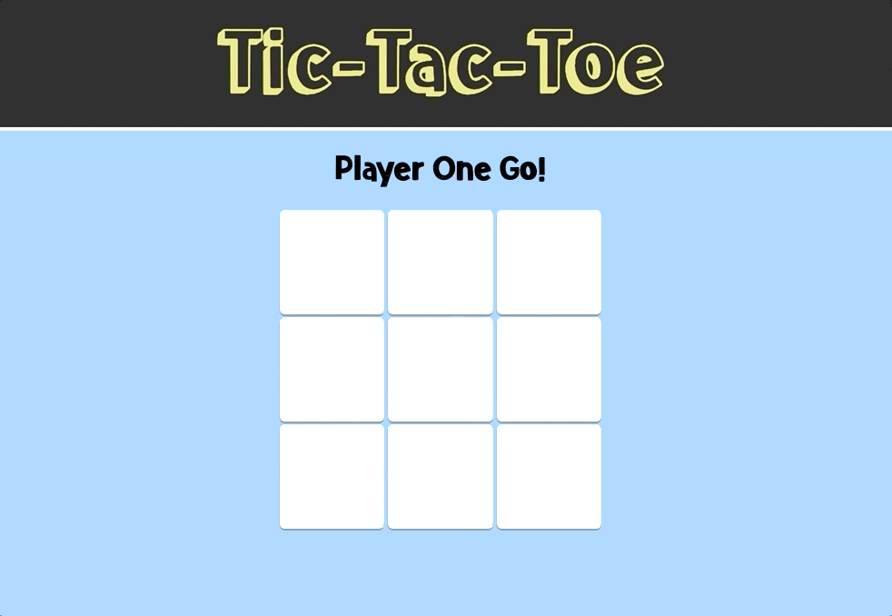

# Tic Tac Toe

### See it live

http://tic-tac-toe-tobiasnorton.surge.sh/

### Summary

This was a pair programming project. I worked with my classmate Toby to create a basic game of Tic Tac Toe using vanilla JavaScript. We chose to designate each box with a number 1 - 9 and give each player an empty array to start with. When a player clicked on a box, the number of the box was pushed to that player's array. After each turn, we implemented the `includes()` method in the win logic to see if a player's array contained winning combinations of boxes. We also disabled buttons once clicked upon so that a player could not select a box once it was taken.

### Project Goals

- [x] Create a Tic Tac Toe game
- [x] Make the two players take turns
- [x] Manipulate DOM elements to display the X's and O's in the appropriate boxes
- [x] Use logic to determine the winner of the game
- [x] Make a "Reset Game" button

### Technologies Used

HTML, CSS, Javascript
